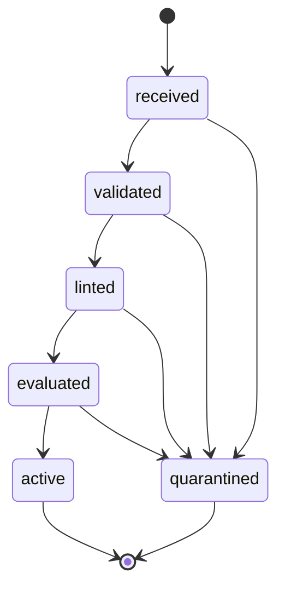

# Compiler boundary and execution contract

## Authority and writable state

The trusted compiler receives a JSON candidate, never arbitrary output paths or
host commands. Its filesystem roots derive from its installed location. It
writes only JSON under `.agent/skills/meta-skill/.state/{receipts,quarantine}`
and an exclusive admission lock. It cannot write the runtime loop, system
prompt, consensus engine or MCP configuration. Generated Python runs without
repository mounts, host credentials, network, Docker socket or tool grants.

Revision 1 is intentionally a narrow Python PEP 723 adapter: Python >=3.11, no
third-party dependencies, CLI `--help` and `--input-json`, scalar closed
argument objects. TypeScript and Wasm are not implemented adapters and are
rejected. The schema must be extended only alongside independently verified
execution support.

The API compiler reads operator-supplied context from bounded regular files
using no-follow/nonblocking descriptors. It emits a candidate and invokes the
gate. Its return value distinguishes a verified admission receipt from a
currently active worker. It no longer writes model-selected paths into the
legacy compiled bank. Manual personal-skill storage and other existing
registries remain separate audit findings.

## Finite state graph

No reverse transitions or retry edges exist. The gate refuses contention
immediately instead of waiting on an admission lock. Evaluation has bounded case
count, time, output, memory and processes. A generated meta-skill remains an
unprivileged leaf: it has no compiler/registry dispatch tool, so it cannot
recursively call this host compiler.

Lineage metadata rejects duplicates, self-reference and more than three parents.
This validates a supplied graph; it does not authenticate ancestry across
independently submitted calls. A future recursive host dispatcher must derive
ancestry from trusted parent receipts and enforce a shared budget. It must not
trust candidate-reset lineage. No recursive host dispatcher is introduced here.

## Context and prefix caching

`SkillsService` keeps invariant compiler instructions and the dispatch schema in
the system message. The workflow and bounded file content are separate
user-message leaves. Limits are eight files, 16 KiB per file/prompt, 64 KiB
aggregate user context and 256 KiB candidate JSON. Over-budget inputs fail
rather than silently truncate.

A host caching adapter should key the prefix by compiler policy digest, schema
version, model/tokenizer identity and stable prompt bytes. Request IDs,
receipts, timestamps, candidates and summaries must stay outside it. This change
preserves message placement; no provider KV-cache hit rate is claimed. Large
payload-reference resolution requires its own authorization/digest/expiry
adapter and is not silently simulated here.

## Isolation and receipts

The operator supplies an already-local image containing Python and
/usr/bin/timeout, pinned as `repository@sha256:<64 hex>` through
`TNF_META_SKILL_IMAGE`. Each execution uses a fresh container with no network,
no host mounts, read-only root, non-root UID, all capabilities dropped, no
privilege escalation, bounded tmpfs, 128 MiB memory, 0.5 CPU and 32 PIDs. The
host owns expected outputs and compares them outside the container. Docker
receives argv, never a shell command string. Dependencies are not installed at
admission.

Payload time is bounded by coreutils timeout inside the container. The host
permits ten additional seconds for startup, force-kills an unresponsive Docker
client, and explicitly removes the exact generated container name. Automatic
--rm is omitted to avoid racing that cleanup. SIGKILL or a machine crash can
bypass cleanup; before clearing an interrupted admission lock, reconcile the
exact orphan process/container with current host state. This compiler does not
claim crash-proof daemon cleanup or automatically remove other containers.
Failure never publishes a Markdown skill or activates a new candidate.

Receipts use exclusive creation, read-only mode, file and directory fsync,
candidate/policy hashes and a receipt content hash. Candidate revision hashing
excludes request IDs and canonicalizes key order, so changing an attempt ID does
not bypass an existing cordon. Receipt hashes are tamper evidence against an
independently pinned trusted policy; they are not user signatures or protection
against an administrator rewriting the entire store. Tenant deployment requires
a separate protected receipt authority.

The ledger refuses growth near 64 MiB or 1024 records. It does not silently
prune provenance. Export/retention is an operator-controlled maintenance action.
A full ledger or unavailable receipt store rejects admission before activation.

On failed replacement, preserve a prior valid transient entry and cordon only
the failed revision. No filesystem rollback of engine code is necessary because
it was never writable. Successful CLI admission ends with process exit; the
receipt is an artifact, not proof that another runtime registered the
capability.
