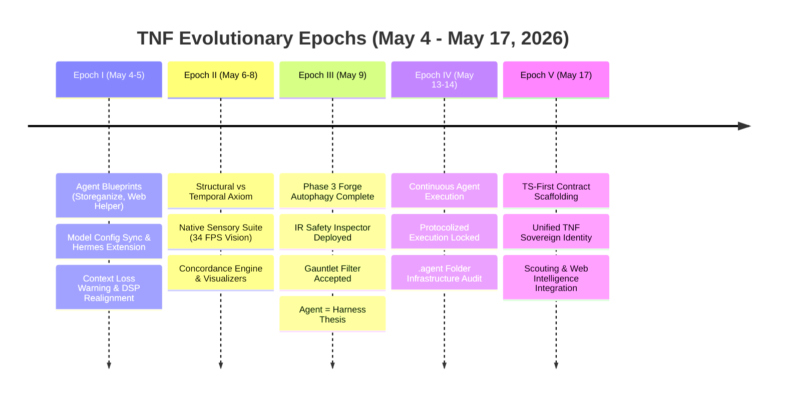

# [CLASS:GRADUATED] [STATUS:VERIFIED] [DOC_TYPE:INTEL_DISTILLATION] [DOMAIN_SCOPE:OPEN_SOURCE]

# Graduated Intelligence Unit: apple_notes_intelligence_distillation.md

**Attribution Hash:** `16c4b2b5bdf9cd8c`  
**Graduation Timestamp:** 2026-08-16T20:55:39.286209Z  
**Gauntlet Metrics:** Density=0.1818 | Procedural=1 | Strategic=13 |
Governance=4

---

# [CLASS:PRIME] [STATUS:VERIFIED] [DOC_TYPE:CHRONOLOGICAL_INTELLIGENCE_LINEAGE] [DOMAIN_SCOPE:TNF_CORE]

# Apple Notes Historical Intelligence Lineage: NEW- May-2026 (Oldest → Newest)

**Provenance & Ingestion Mandate:**

- **Source**: Apple Notes (`NEW- May-2026`, Folder PK: 6199, Total Notes: 45)
- **Ingestion Order**: Strict Chronological Progression (May 4, 2026 → May
  17, 2026)
- **Framework Protocol**: TNF State-Freshness Axiom Suite & Intelligence
  Pipeline Gauntlet

---

## 🏛️ The 5 Evolutionary Epochs of the May 2026 Sprint

---

## 📜 Detailed Chronological Progression (Oldest → Newest)

### Epoch I: Genesis, Concept Ideation & Infrastructure Diagnostics (May 4 – May 5)

_Initial focus on productized agent capabilities, resilience against provider
drift, and diagnostic mapping of the monorepo._

1. **[PK:6200] [2026-05-04 13:39 UTC] Community Scour & Value Agent**:
   - _Directive_: Autonomous agent scouring forums and channels to provide
     high-utility technical solutions for free, sustained via voluntary
     tipping/appreciation.
2. **[PK:6201] [2026-05-04 13:55 UTC] Storeganize Blueprint**:
   - _Directive_: Domain-expert spatial system designed to organize storage,
     placement, and visual hierarchy across micro and macro physical spaces.
3. **[PK:6202] [2026-05-04 19:44 UTC] Model Config Harmonization**:
   - _Action_: Fixed 5 missing model definitions across agent configurations.
4. **[PK:6203] [2026-05-05 00:47 UTC] Modular Hermes Provider Extension**:
   - _Directive_: Architected an isolated plugin/extension for Hermes to prevent
     upstream package updates from wiping custom LLM provider-model mappings.
5. **[PK:6204] [2026-05-05 01:15 UTC] Session Cookie Retrieval (`rookiepy`)**:
   - _Action_: Implemented direct browser cookie extraction via `rookiepy` for
     session authentication bridges.
6. **[PK:6205–6207] [2026-05-05 02:14–02:37 UTC] Contextual Depth Warning &
   Narrative Arc**:
   - _Axiom_: Warning issued regarding the severe loss of contextual depth in
     standard multi-turn LLM summarization. Mandated synthesis into narrative
     timelines with explicit connection arcs.
7. **[PK:6208–6213] [2026-05-05 12:53–16:16 UTC] DSP-Arch Disentanglement &
   System Overview**:
   - _Course Correction_: Separated DSP-Arch assumptions from general system
     pipelines. Completed comprehensive system overview of `thenewfuse.com`.

---

### Epoch II: Structural Persistence & Concordance Visualizers (May 6 – May 8)

_Transition to foundational systems: Concordance indexing, SIMD native sensory
capture, and the persistence-temporal duality._

8. **[PK:6215–6216] [2026-05-06 17:08–17:25 UTC] Unified Organizational
   Analysis**:
   - _Action_: Synthesized deep cross-domain monorepo structures, acknowledging
     that surface-level scans capture only a fraction of deep repo logic.
9. **[PK:6217] [2026-05-06 18:34 UTC] The Persistence-Interactive Duality**:
   - _Foundational Axiom_:
     $$\text{Structural} \equiv \text{Persistence (Merkle tree, weights, KB)}$$
     $$\text{Temporal} \equiv \text{Interactive (Agent sessions, TTYs, CLI loops)}$$
10. **[PK:6218–6221] [2026-05-08 17:01–19:25 UTC] Concordance Engine,
    Visualizers & Skill**:
    - _Delivery_: Created standalone HTML visualizer
      (`TNF_CONCORDANCE_VISUALIZER.html`), React explorer components in
      `packages/ui-consolidated`, and codified `SKILL.md` for codebase
      concordance analysis.
11. **[PK:6219] [2026-05-08 18:45 UTC] Native Sensory Suite Verified**:
    - _Milestone_: Achieved 34 FPS native screen mirroring (`bgra2jpeg_turbo`)
      and sub-millisecond vDSP audio frequency matching.
12. **[PK:6224] [2026-05-08 20:12 UTC] The Harness Definition**:
    - _Axiom_: Formalized that the **TNF agent IS the full agentic harness,
      procedure, protocol, and mixture-of-experts orchestrator**.
13. **[PK:6225–6226] [2026-05-08 21:15–21:38 UTC] Next-Gen Milestone & Monorepo
    Hardening**:
    - _Action_: Passed core package validation and deployed comprehensive
      hardening pass across all critical paths.

---

### Epoch III: Forge Autophagy, Native Intelligence & The Gauntlet (May 9)

_Peak native kernel breakthrough: Re-forging core Node.js paths into Rust/C++,
establishing formal IR safety gates, and codifying the Intelligence Pipeline
Gauntlet._

14. **[PK:6227] [2026-05-09 00:57 UTC] Phase 3.4: IR Safety Inspector**:
    - _Security Gate_: Zero-trust heuristic gatekeeper deployed to inspect LLVM
      IR and prevent native code generation from introducing forbidden syscalls.
15. **[PK:6229] [2026-05-09 04:28 UTC] Phase 3: Forge Autophagy Complete**:
    - _Breakthrough_:
      - Re-forged **Synaptic Bus** in Rust (~49k msg/s throughput).
      - Re-forged **Vector Acceleration** (SIMD AVX2, ~610M dims/sec).
      - Re-forged **Gateway Synapse** in Rust (35% throughput boost).
16. **[PK:6228] [2026-05-09 04:31 UTC] Supabase Concordance HTTP API**:
    - _Deployment_: Edge function endpoints (`/stats`, `/top`, `/lookup`,
      `/power-phrases`) live on Supabase.
17. **[PK:6230] [2026-05-09 04:38 UTC] Phase 4.1: Native Intelligence
    Synthesis**:
    - _Artifact_: Forged `weight_forge_output.dylib`, encoding 15,000+ codebase
      relationships directly into a native weight matrix.
18. **[PK:6231–6233] [2026-05-09 04:58–05:21 UTC] Block Factoid Decomposition &
    Pipeline Nodes**:
    - _Protocol_: Decomposition of whole original information blocks into
      attributable factoids using proprietary TNF pipeline nodes.
19. **[PK:6232] [2026-05-09 05:05 UTC] `TNF_INTELLIGENCE_PIPELINE_GAUNTLET.md`
    Ratified**:
    - _Governance_: Unanimously accepted (+38, -0).
20. **[PK:6234] [2026-05-09 05:35 UTC] The Bedrock Doctrine**:
    > _"The model is the engine, but the Agent is the Harness."_
21. **[PK:6235] [2026-05-09 05:53 UTC] Factory Blueprint & Super Cycle**:
    - _Roadmap_: Alignment with the TNF Framework Super Cycle.

---

### Epoch IV: Protocolization & Infrastructure Audit (May 13 – May 14)

_Systematizing agent autonomy and auditing long-term drift in agent
directories._

22. **[PK:6236–6237] [2026-05-13 12:51–17:09 UTC] Protocolized Continuous Agent
    Execution**:
    - _Action_: Shifted agent runtime from episodic one-offs to sustained,
      protocolized background workflows governed by state ledgers.
23. **[PK:6238] [2026-05-13 20:55 UTC] TNF CLI Audit & Self-Improvement Loop**:
    - _Action_: Implemented canonical self-improvement loop for the CLI.
24. **[PK:6239] [2026-05-14 18:13 UTC] Agent Folder Infrastructure Audit**:
    - _Action_: Audited structural drift across `agent/`, `agents/`, and
      `.agent/` directories to standardize layout.

---

### Epoch V: Monorepo Contracts, Identity Cohesion & Live Scouting (May 17)

_Final contract unification and re-affirmation of the sovereign collective
mission._

25. **[PK:6241–6242] [2026-05-17 00:21–06:50 UTC] TS-First Contract
    Scaffolding**:
    - _Action_: Implemented strict TypeScript-first contracts and rewired
      consumers across every package, SaaS page, and CLI tool.
26. **[PK:6243] [2026-05-17 11:39 UTC] The Sovereign Mission Mandate**:
    > _"It is fine that you have been working on openclaw. But, remember that
    > ultimately we are all working on tnf. tnf is our agent, tnf is our
    > collective harness."_
27. **[PK:6244–6245] [2026-05-17 13:08–13:12 UTC] Architectural Reconnection &
    Workflow Cross-Checks**:
    - _Standard_: Selective reconnection of packages only where architectural
      fit is clean; verified workflow-engine cross-checks.
28. **[PK:6246] [2026-05-17 13:17 UTC] Fresh Internet Scouting Pipeline**:
    - _Milestone_: Successfully integrated real-time external research and
      scouting into the TNF knowledge ingestion engine.

---

## 🎯 Direct Actionable Takeaways for Current Session

1. **Maintain Ingestion Chronology**: All incoming data (YouTube AI 6
   transcripts, notes, web scouting) must be organized strictly from
   source-timestamp/chronological origin to track systemic evolution without
   flattening historical nuance.
2. **Execute Attribution Overrule**: Every ingested factoid must reference its
   origin epoch and document header.
3. **Keep OpenClaw Subordinate to TNF**: Ensure all multi-channel gateways feed
   directly into the central Synaptic Bus and Merkle Tree.
