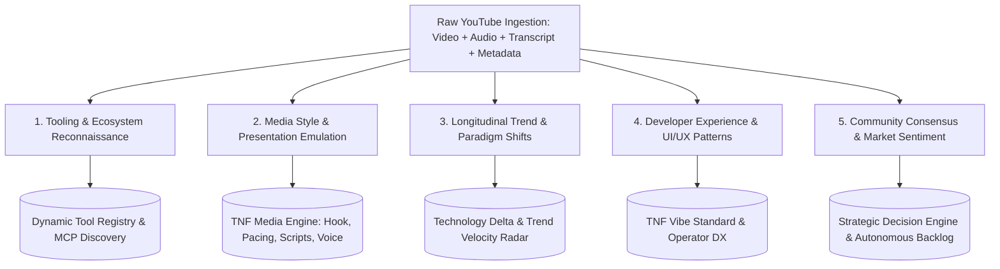
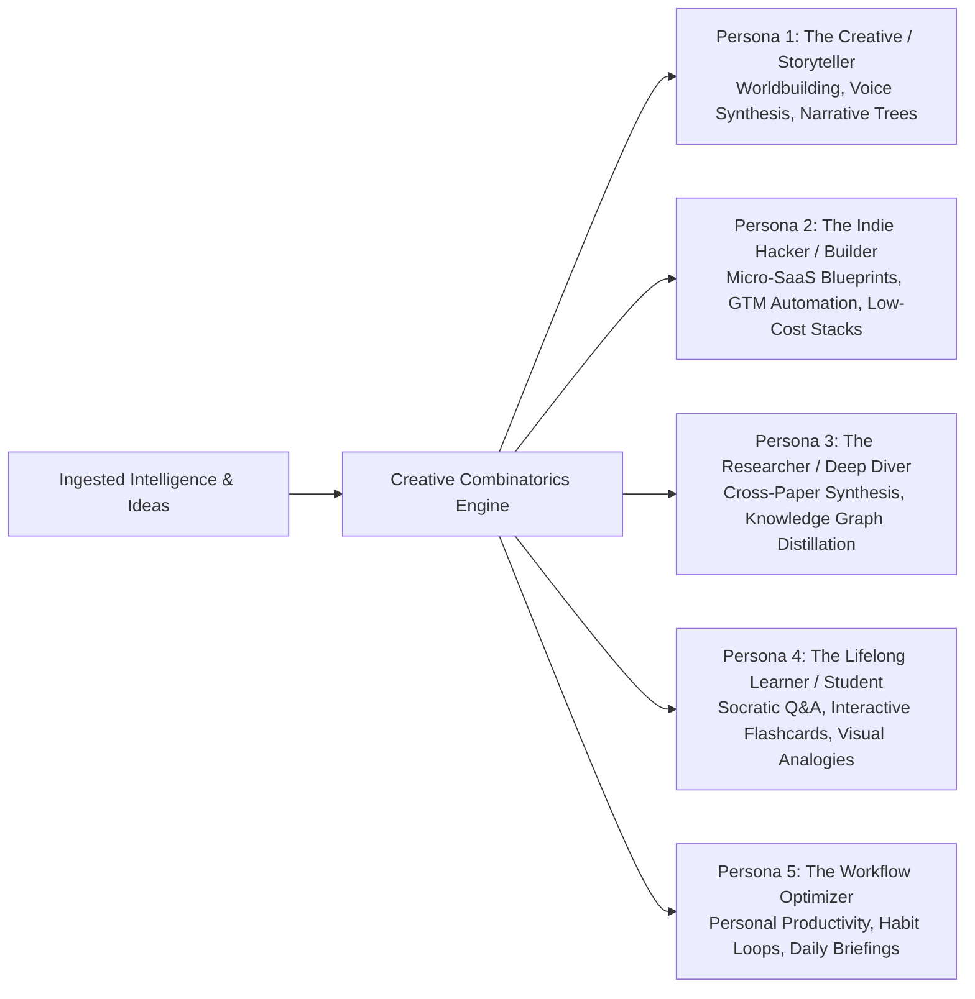

# 🎬 Comprehensive Value & Action Matrix for Video Intelligence Ingestion

## 1. Executive Framing

When we ingest technical and creative YouTube videos into The New Fuse (TNF), we
are not merely extracting code snippets. We are tapping into an active, live
cultural and engineering ecosystem.

This document formalizes the **5 Extended Value Vectors** that transform raw
video ingestion into deep, operational leverage across engineering, media
generation, tool discovery, and market sensing.

---

## 2. The 5 Extended Value Vectors



---

## 3. Deep Dive into the Extended Value Vectors

### Vector 1: Tooling & Ecosystem Reconnaissance (The Tool Radar)

_Beyond just code, what software, libraries, MCP servers, SaaS tools, and local
utilities are builders actually using in the wild?_

- **Sourcing & Discovery**: Identifying niche GitHub repos, unseen CLI
  utilities, experimental Python/Rust packages, and emerging MCP servers
  mentioned offhandedly by creators.
- **Integration Techniques & Wiring**: How creators hook different tools
  together (e.g. chaining Ollama with FastEmbed and SQLite-vec; bridging Cursor
  with custom MCP sidecars).
- **Tool Usability & Friction Notes**: What broke for the creator? Which tool
  had confusing setup or secret dependencies? (Instant failure archaeology).
- **Target Artifact in TNF**: Dynamic **Tool Registry & Evaluation Matrix**
  (`data/tool-registry.json`), flagging candidate tools for the Genesis Agent or
  Forge to test.

---

### Vector 2: Presentation Format & Media Style Emulation (The Creator Engine)

_How do top-tier creators structure narrative hooks, pacing, visual metaphors,
and demonstrations to communicate complex AI concepts effortlessly?_

- **Narrative Arc & Hook Analysis**:
  - The "Cold Open" formula (e.g., demonstrating the end-state demo in the first
    15 seconds).
  - Pacing and rhythm: when to zoom in on code vs. when to use a high-level
    architecture diagram.
- **Pedagogical Metaphors**:
  - How complex topics (e.g., KV cache compression, test-time compute, DACC
    envelopes) are explained through relatable mental models.
- **Script & Production Blueprints for TNF**:
  - Generating video scripts, slide layouts, and interactive tutorials for TNF's
    own documentation and public media output (e.g., YouTube tutorials, release
    demos).
- **Target Artifact in TNF**: **Media & Video Production Playbooks**
  (`docs/media/video-production-templates.md`) providing automated script
  templates and presentation frameworks for TNF agents to generate our own
  content.

---

### Vector 3: Longitudinal Trend Detection & Paradigm Shifts (The Macro Radar)

_Tracking how concepts evolve over time, from early experimental hype to mature
production standards._

- **Repeating Technical Patterns**:
  - Recognizing when 10 different unrelated creators all independently converge
    on the same paradigm (e.g., transitioning from LangChain agents
    $\rightarrow$ lightweight single-loop bash harnesses $\rightarrow$ MCP tool
    callers).
- **Pivots & Deprecations**:
  - Noting when previously recommended tools or methods fall out of favor (e.g.,
    why vector databases without hybrid BM25 search failed in production).
- **Trajectory Forecasting**:
  - Projecting what capability will become table stakes 6 months from now based
    on the velocity of research demos transitioning into practitioner tutorials.
- **Target Artifact in TNF**: **Longitudinal Tech Trend Radar**
  (`docs/intelligence/trend-velocity-radar.md`), which scores frameworks by
  adoption momentum vs. architectural decay.

---

### Vector 4: Developer Experience (DX) & Human-in-the-Loop UX Patterns

_How are creators interacting with their IDEs, terminals, and web UIs? What
visual and keyboard workflows minimize friction?_

- **Workflow Ergonomics**:
  - Keyboard shortcuts, terminal window tiling, visual feedback states, and
    split-screen layouts used by high-velocity coders.
- **Agent Interactivity Modes**:
  - How users prefer to give feedback to autonomous agents (e.g., inline diff
    inspection vs. chat command bars vs. voice triggers).
- **Target Artifact in TNF**: **TNF Operator Experience (OX) Standard**
  (`apps/frontend`, `apps/chrome-extension`, and `packages/tnf-cli` design
  guidelines).

---

### Vector 6: User-Centric Persona Synthesis & Creative Combinatorics

_Moving beyond admin/developer utility to empower individual users with diverse
interests (e.g. creatives, researchers, hobbyists, entrepreneurs, educators)._



- **Cross-Domain Synthesis (Creative Combinatorics)**:
  - Actively looking for how a concept from one domain (e.g., audio DSP spectral
    filtering) can combine with an unrelated user interest (e.g., financial
    market signal analysis or real-time gaming dialog).
  - Asking: _"How can this tool or technique be repurposed for someone with zero
    interest in TNF core infrastructure?"_
- **Personalized Second Brain Projections**:
  - Automatically synthesizing tailored outputs:
    - _For Writers/Creatives_: Interactive world-building wikis, dialog
      generators, scene pacing guides.
    - _For Indie Creators_: Reusable launch playbooks, YouTube hook libraries,
      automated newsletter drafts.
    - _For Non-Technical Users_: Plain-English explainers, step-by-step beginner
      tutorials, and zero-code workflow automations.
- **The "Sovereign Individual" Alignment**:
  - Honoring TNF's foundational tenet that the system exists to empower the
    **Sovereign Individual** to express their own unique vision, curiosity, and
    creative freedom.

---

## 4. The Recursive Meta-Extraction Mandate (Expanding Ingestion Parameters)

In The New Fuse, **the extraction schema itself is NOT static**. Ingestion is an
evolving, self-refining process. Every video ingestion session must execute a
**Meta-Extraction Step**:

```
[Video Transcript] ──► [Extract Established Vectors] ──► [Meta-Extraction Scan]
                                                               │
                                                               ▼
                                                [Did this creator use a novel
                                                 way of thinking, framing, or
                                                 structuring information?]
                                                               │
                                                 YES ──────────┴────────── NO
                                                  │                         │
                                                  ▼                         ▼
                                         [Propose NEW Ingestion     [Continue Standard
                                          Parameter / Vector]        Processing]
```

### The Continuous Expansion Mandate:

During every transcript analysis, the agent must ask:

1. **"What novel angle or cognitive framing did this creator employ that our
   current vectors did not anticipate?"**
2. **"Can this novel framing be codified into a reusable parameter for all
   future ingestion runs?"**
3. **"How does this expand our ability to turn external media into internal
   capabilities?"**
4. **"What unexpected combinations could delight or empower an end user
   exploring their personal passions?"**

When a new extraction angle is identified (e.g. _Economic Token Arbitrage_,
_Psychological Flow States for Deep Work_, _Multi-Model Verification
Triangles_), the agent MUST log a proposed vector addition to
[`docs/protocols/EXPANDED_VIDEO_INTELLIGENCE_SPEC.md`](file://<TNF_ROOT>/docs/protocols/EXPANDED_VIDEO_INTELLIGENCE_SPEC.md).

---

## 5. The Master Video Ingestion Prompt Specification (V4 - User-Centric & Creative)

```markdown
You are the TNF Multi-Vector Intelligence Engine. Ingest the provided video
transcript and extract actionable intelligence across all operational vectors:

### 1. Tooling & Ecosystem Discovery

- List all tools, libraries, GitHub repos, and MCP servers mentioned.
- Extract concrete installation/integration wiring examples.
- Document specific friction points or setup traps noted by the speaker.

### 2. Media Style & Presentation Emulation

- Analyze the video's pedagogical structure: Hook, narrative progression, visual
  demo timing, and conceptual metaphors.
- Generate a reusable 3-minute video script template for TNF emulating this
  presentation style.

### 3. Longitudinal Trends & Architectural Trajectory

- What underlying engineering pattern is demonstrated?
- Is this an emerging standard, an active trend, or a replacement for an older
  paradigm?
- How does this modify or reinforce TNF's existing architectural decisions?

### 4. Developer Experience & Workflow Ergonomics

- What UX/DX patterns (keyboard shortcuts, interface layouts, interaction loops)
  made the creator effective?
- How can TNF CLI / Chrome Extension / UI adopt these ergonomic flows?

### 5. Ground-Truth Realities & Failure Archaeology

- Extract unvarnished benchmarks, cost figures, local hardware constraints, and
  anti-patterns encountered.

### 6. User-Centric Creative Combinatorics (The Multi-Persona Lens)

- Brainstorm 2-3 novel, unexpected ways this information can be repurposed for
  end users with diverse passions (e.g., creative writing, indie business,
  personal learning, hobby projects).
- What unique cross-domain combinations emerge from this technique?

### 7. Meta-Extraction: Ingestion Parameter Expansion

- Identify any novel way the creator structured information, problem-solved, or
  operated that falls outside the above categories.
- Propose a concrete new extraction parameter / rule to permanently upgrade
  TNF's ingestion protocol.
```
