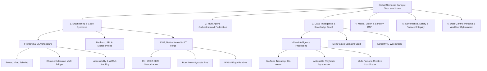

# 🌳 Hierarchical Semantic Skill Tree (HSST) & Traversable Capability Fabric

**Status:** ACTIVE **Class:** [CLASS:PRIME] **Doc Type:**
[DOC_TYPE:PROTOCOL_STANDARD] **Visibility:** [VISIBILITY:COLLECTIVE]

> **Progressive Disclosure Mandate:** Agents must never load flat lists of
> skills into active memory. Skills are strictly navigated via Progressive
> Disclosure: Root Semantic Index -> Branch Index -> Leaf Execution Skill. This
> prevents context bloat while preserving total discoverability.

## 1. The Core Flaw of the Flat "Inactive Vault" Model

The legacy pattern (`skills/` vs `skills_inactive/` with `skill-management`
requiring manual searching or directory shuffling):

- **Is reactive and brittle**: The agent only searches `skills_inactive` if it
  happens to guess that a hidden tool exists.
- **Lacks semantic navigation**: Flat file lists provide zero contextual bridges
  between related domains.
- **Blinds the agent**: If a skill is vaulted, the agent doesn't even know what
  it doesn't know.

---

## 2. The Solution: The Semantic Root & Branching Tree Architecture

Rather than dumping flat leaf skills or hiding them in dark vaults, every
onboarded agent receives **Universal Semantic Root Categories**. Each root
category acts as an indexical anchor that radiates **Semantic Bridges** down to
sub-categories, specialized skills, and traversable data layers:



---

## 3. The 4-Tier Semantic Tree Schema

Every node in the Semantic Skill Tree is structured with explicit upward,
downward, and lateral traversability:

```json
{
  "$schema": "tnf/semantic-skill-node/1.0",
  "node_id": "tnf:skill:engineering:llvm_forge",
  "name": "LLVM Native Forge Accelerator",
  "depth_tier": "Tier-2 (Specialized Branch)",

  "lineage": {
    "root_category": "Engineering & Code Synthesis",
    "parent_branch": "Native Kernel & JIT Acceleration",
    "sub_specialties": [
      "tnf:skill:simd_avx2_vector_math",
      "tnf:skill:rust_synaptic_relay",
      "tnf:skill:llvm_ir_safety_inspector"
    ]
  },

  "semantic_bridges": {
    "lateral_affinities": [
      "tnf:skill:sensory:audio_dsp_matching",
      "tnf:skill:intelligence:vector_embedding_acceleration"
    ],
    "required_protocols": ["docs/protocols/THE_VELOCITY_INTEGRITY_BALANCE.md"]
  },

  "activation_trigger": {
    "intent_keywords": [
      "compile",
      "JIT",
      "SIMD",
      "C++",
      "Rust",
      "LLVM",
      "acceleration",
      "throughput"
    ],
    "context_conditions": [
      "high_throughput_data_stream",
      "native_code_optimization"
    ]
  }
}
```

---

## 4. How Traversable Context Injection Works in Practice

1. **Initial Agent Onboarding (The Semantic Canopy)**:
   - The agent is booted with lightweight **Root Category Nodes** (costing <1%
     of context budget).
   - Each root node exposes its immediate primary branches and intent triggers.

2. **Dynamic Context-Driven Expansion (Traversability)**:
   - When the user prompt or interactive state touches a specific intent (e.g.
     _"We need to analyze these video transcripts and optimize vector search"_):
   - The harness traverses:
     - `Data & Intelligence` $\rightarrow$ `Video Intelligence Processing`
       $\rightarrow$ `Actionable Playbook Synthesizer`
     - _Lateral Bridge_: $\rightarrow$ `LLVM Native Forge` $\rightarrow$
       `SIMD Vector Acceleration`
   - Only the specific sub-branch and its lateral connections are hydrated into
     active RAM.

3. **Contextual Pruning & Re-docking**:
   - When the sub-task completes, the detailed leaf instructions fold back up to
     their parent branch, leaving only a lightweight receipt.
   - The agent never loses awareness of the tree; it always retains the
     indexical map to traverse deeper whenever required.

---

## 5. Next Steps for Implementation in TNF Harness

1. **Replace Flat Guard with Tree Resolver**: Upgrade
   `universal-skill-disclosure-guard.cjs` into
   `hierarchical-skill-tree-resolver.cjs`.
2. **Standardize Skill Frontmatter**: Ensure every `.skill` has `root_category`,
   `sub_specialties`, and `semantic_bridges` defined in `SKILL.md`.
3. **Integrate with DACC & Relay**: Allow agents to publish and query skills
   over the Synaptic Bus via semantic graph traversal.
