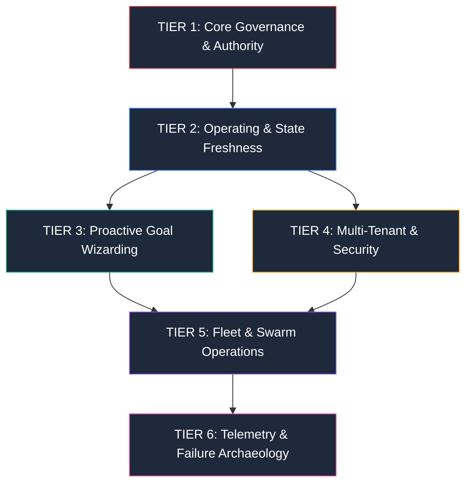

# TNF Master Protocol Architecture Map & Logical Hierarchy

[CLASS:PRIME] [STATUS:ACTIVE] [DOC_TYPE:INDEX]

**Canonical Location:** `docs/protocols/PROTOCOL_MAP.md`  
**Last Revised:** 2026-08-06  
**Authority:** Sub-Director Swarm / Master System Architect

---

## Executive Overview

The New Fuse (TNF) operates on a **staged, multi-tiered protocol hierarchy**.
Every protocol file in `docs/protocols/` belongs to a specific functional tier
and connects logically to sibling and child sub-protocols.

This document provides the authoritative map, logical explanations, and
parent-child dependencies across all 77 protocol specifications in TNF.

---

## Tier 1: Core Governance & Authority Protocols (The Foundation)

These protocols define the non-negotiable legal, structural, and operational
rails of TNF.

| Master Protocol                                                      | Sub-Protocols & References                                                            | Logical Explanation                                                                                                       |
| :------------------------------------------------------------------- | :------------------------------------------------------------------------------------ | :------------------------------------------------------------------------------------------------------------------------ |
| [`TNF_GOVERNANCE_TENETS.md`](./TNF_GOVERNANCE_TENETS.md)             | • `DIRECTIVES.md` • `TNF_DIRECTIVES.md` • `THE_VELOCITY_INTEGRITY_BALANCE.md` | **The Constitution:** Establishes the Attribution Cornerstone, Sovereign Individual, and Directives D1 & D9 safety gates. |
| [`AUTHORITY_INTEGRATION_MAP.md`](./AUTHORITY_INTEGRATION_MAP.md)     | • `AUTHORITY_TURNUP_RUNBOOK.md` • `agent-self-edit-protocol-v0.1.md`              | **Authority Surface Guard:** Controls permissions and edit-lock rules for core harness files (`AGENTS.md`).               |
| [`DACC_PROTOCOL_MASTER_MANUAL.md`](./DACC_PROTOCOL_MASTER_MANUAL.md) | • `DACC_POML_MCP_A2A_INTEGRATION_BLUEPRINT.md`                                        | **Deterministic Agent Communication:** Governs POML (Prompt Object Markup Language) and MCP communication boundaries.     |

---

## Tier 2: Operating & State Freshness Protocols (The Harness)

These protocols govern session startup, runtime execution, and empirical state
validation.

| Master Protocol                                                                                      | Sub-Protocols & References                                      | Logical Explanation                                                                                                    |
| :--------------------------------------------------------------------------------------------------- | :-------------------------------------------------------------- | :--------------------------------------------------------------------------------------------------------------------- |
| [`TURN_ZERO_MANDATE.md`](./TURN_ZERO_MANDATE.md)                                                     | • `SESSION_HANDOFF_ENFORCEMENT.md` • `TURN_END_MANDATE.md`  | **Session Lifecycle Engine:** Mandates staged context loading, environment surface rendering, and clean handoffs.      |
| [`STATE_FRESHNESS_AXIOM_SUITE.md`](./STATE_FRESHNESS_AXIOM_SUITE.md)                                 | • `LIVING_STATE.md` • `TNF_BOOK_OF_AXIOMS.md`               | **Empirical Grounding:** Mandates continuous re-verification of runtime evidence; forbids cached assumptions.          |
| [`TNF_OPERATOR_TERMINAL_INVIOABILITY_PROTOCOL.md`](./TNF_OPERATOR_TERMINAL_INVIOABILITY_PROTOCOL.md) | • `TNF_AGENT_SHELL_HYGIENE.md` • `twip-operator-runbook.md` | **Terminal Isolation (TWIP):** Prevents agent interference with human terminal windows across Dual-Terminal processes. |

---

## Tier 3: Proactive Goal-Achievement & Wizarding Protocols (The Drive)

These protocols power the proactive user engagement and goal tracking engine.

| Master Protocol                                                                          | Sub-Protocols & References                                                   | Logical Explanation                                                                                                                              |
| :--------------------------------------------------------------------------------------- | :--------------------------------------------------------------------------- | :----------------------------------------------------------------------------------------------------------------------------------------------- |
| [`TNF_PROACTIVE_GOAL_WIZARDING_PROTOCOL.md`](./TNF_PROACTIVE_GOAL_WIZARDING_PROTOCOL.md) | • `.agent/skills/tnf-proactive-goal-wizard/SKILL.md` • `GoalsService.ts` | **Goal Achievement Engine:** 5-Stage Wizarding Flywheel (Intent Extraction → Asset Discovery → Milestone Breakdown → Fleet Dispatch → Tracking). |
| [`TNF_FEDERATED_TAG_SYNERGY_SPEC.md`](./TNF_FEDERATED_TAG_SYNERGY_SPEC.md)               | • `TNF_DOCUMENT_TAGGING_PROTOCOL.md` • `UTP_SPEC_v1.0.md`                | **Unified Tagged Entity (UFTE):** Binds document tags, base58 federated entity IDs, and 5W1H context into indexable nodes.                       |
| [`TNF_CONTEXTUAL_GROUNDING_MARKERS_SPEC.md`](./TNF_CONTEXTUAL_GROUNDING_MARKERS_SPEC.md) | • `TNF_SYSTEM_LOGICAL_COHESION_MANUAL.md`                                    | **Context Pointers:** Defines `[TOOL_PATHWAY]`, `[5W1H_MATRIX]`, and `[FAILURE_BEACON]` navigational markers for agents.                         |

---

## Tier 4: Multi-Tenant, Security & Tagging Protocols (The Boundaries)

These protocols enforce tenant data boundaries, security rules, and
classification tags.

| Master Protocol                                                                                          | Sub-Protocols & References            | Logical Explanation                                                                                                             |
| :------------------------------------------------------------------------------------------------------- | :------------------------------------ | :------------------------------------------------------------------------------------------------------------------------------ |
| [`TNF_DOCUMENT_TAGGING_PROTOCOL.md`](./TNF_DOCUMENT_TAGGING_PROTOCOL.md)                                 | • `TNF_DOCUMENT_VETTING_PROCEDURE.md` | **Classification Headers:** Enforces mandatory `[CLASS] [STATUS] [DOC_TYPE] [VISIBILITY]` tags on all documentation.            |
| [`TNF_CORPORATE_DEPARTMENT_ORCHESTRATION_MANUAL.md`](./TNF_CORPORATE_DEPARTMENT_ORCHESTRATION_MANUAL.md) | • `security.guard.ts`                 | **Multi-Tenant Domain Scoping:** Scopes corporate dev, agency client workspaces, and personal productivity bounds (`tenantId`). |

---

## Tier 5: Swarm, Fleet & Interoperability Protocols (The Fleet)

These protocols orchestrate multi-agent coordination, fleet communication, and
self-evolution.

| Master Protocol                                                                                    | Sub-Protocols & References                                                                    | Logical Explanation                                                                                                                                                                                                              |
| :------------------------------------------------------------------------------------------------- | :-------------------------------------------------------------------------------------------- | :------------------------------------------------------------------------------------------------------------------------------------------------------------------------------------------------------------------------------- |
| [`TNF_CONCURRENT_AGENT_COORDINATION_PROTOCOL.md`](./TNF_CONCURRENT_AGENT_COORDINATION_PROTOCOL.md) | • `MULTI_AGENT_INTEGRATION_PROTOCOL.md` • `AGENT_WHO_IS_WHO.md`                           | **Swarm Orchestration:** Controls multi-agent work partitioning, sub-director loops, and envelope relay dispatch.                                                                                                                |
| [`TNF_AGENT_WORKSPACE_ISOLATION_PROTOCOL.md`](./TNF_AGENT_WORKSPACE_ISOLATION_PROTOCOL.md)         | • `TNF_CONCURRENT_AGENT_COORDINATION_PROTOCOL.md` • `MULTI_AGENT_INTEGRATION_PROTOCOL.md` | **Workspace Isolation:** Which physical checkout an agent works in, by task class. Bars HEAD-moving commands (stash/checkout/reset/merge/clean) from shared trees. Machine policy: `docs/protocols/agent-workspace-policy.json`. |
| [`TNF_FLEET_HEALTH_PROBE_PROTOCOL.md`](./TNF_FLEET_HEALTH_PROBE_PROTOCOL.md)                       | • `tnf-master-reconciliation-runner.cjs`                                                      | **Fleet & LLM Liveness Probe:** Re-validates 24+ LLM endpoints, background daemons, and system process health.                                                                                                                   |
| [`reports/PROTOCOL_COHESION_RECONCILIATION_2026-08-09.md`](./reports/PROTOCOL_COHESION_RECONCILIATION_2026-08-09.md) | • `TNF_COLLISION_PROVISION.md` • `TNF_FEDERATED_TAG_SYNERGY_SPEC.md` • `.agent/ROLE_DEFINITIONS.md` (Phase 8/9) | **Cohesion Audit:** Reconciles the 2026-08-09 work against existing protocols. Resolves the `ID#` routing collision, the UFTE/`mcid` name clash, and C2's data-loss recovery guidance. Catalogues `docs/protocols/schemas/` (13) and `bridges/` (13) plus the protocol acronym inventory. |
| [`tnf-cron-governance-protocol-v0.1.md`](./tnf-cron-governance-protocol-v0.1.md)                   | • `TNF_STAFF_MASTER_CALENDAR_AND_SCHEDULE.md`                                                 | **Cron Master Governance:** Manages 35 recurring background schedules across system and tenant categories.                                                                                                                       |

---

## Tier 6: Telemetry, Handoff & Failure Archaeology (The Memory)

These protocols preserve multi-session history, failure archaeology, and system
handoffs.

| Master Protocol                                                                | Sub-Protocols & References                                         | Logical Explanation                                                                                                     |
| :----------------------------------------------------------------------------- | :----------------------------------------------------------------- | :---------------------------------------------------------------------------------------------------------------------- |
| [`AGENT_STATUS_LEDGER.md`](./AGENT_STATUS_LEDGER.md)                           | • `CHALLENGE_RATIONALE_LOG.md` • `SESSION_HANDOFF_TEMPLATE.md` | **System Handoff Ledger:** Chronological record of every completed session, commit hash, and pending next actions.      |
| [`UTP_SPEC_v1.0.md`](./UTP_SPEC_v1.0.md)                                       | • `EXECUTABLE_INTELLIGENCE_FRAMEWORK.md`                           | **Universal Timeline Protocol:** Normalizes multi-channel event streams (Discord, Git, Slack) into timeline primitives. |
| [`TNF_ARTIFACTS_LIFECYCLE_PROTOCOL.md`](./TNF_ARTIFACTS_LIFECYCLE_PROTOCOL.md) | • `MEMPALACE_META_CHART.md`                                        | **Artifact Memory Engine:** Controls creation, retention, pruning, and spatial visualization of generated artifacts.    |
