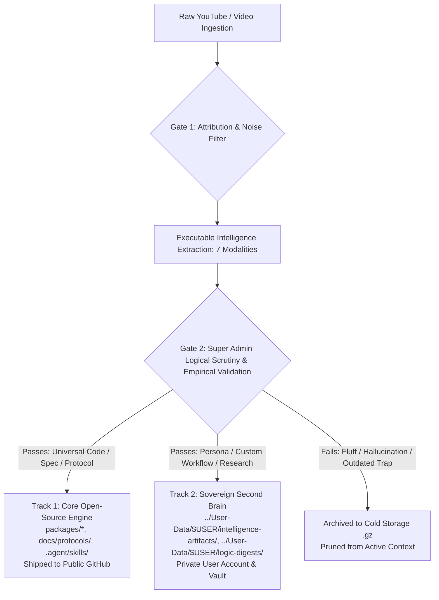

# 🏛️ The Sovereign Distillation & Dual-Track Ingestion Protocol

`[CLASS:PRIME] [STATUS:LOCKED] [SCOPE:SYSTEM-WIDE]` **Authority:** Super Admin
Ingestion & Open-Source Publication Mandate

---

## 1. The Core Law of Ingestion Separation

When raw external media (YouTube transcripts, research papers, tech talks) are
ingested into The New Fuse, AI agents **MUST NEVER** blur the line between:

1. **Track 1: The Core Distributable Baseline (Open Source)**:
   - The battle-tested, verified, universally applicable engineering
     abstractions and logical progressions that will be shipped to any user
     downloading TNF.
   - **Must be**: Zero-bloat, framework-agnostic, deterministic, and free of any
     personal user data, private keys, or niche situational logs.
2. **Track 2: The Sovereign Second Brain (User / Super Admin Private Layer)**:
   - The user's personal knowledge graph, niche study dossiers, custom
     workflows, creative prompts, and project-specific notes.
   - **Must be**: Bound strictly to the user's private workspace / account
     storage, never committed to public repo source branches.



---

## 2. The 4-Gate Scrutiny & Validation Funnel

Every piece of information extracted from video transcripts must pass through 4
strict logical gates before being admitted to either track:

### Gate 1: Provenance & Attribution (The Attribution Cornerstone)

- **Question**: Is the source, speaker, author, and timestamp verifiable?
- **Action**: Reject ungrounded claims. Obscuring human origin triggers
  immediate nullification.

### Gate 2: The Velocity-Integrity Scrutiny (Anti-Drift Check)

- **Question**: Does this new claim try to silently overwrite a proven legacy
  rail (e.g. Turn Zero, DACC contracts, mutation guards)?
- **Action**: Any new pattern must pass the **Parallel Verification Step**
  (demonstrable benchmark or architectural proof) before it can modify core
  defaults.

### Gate 3: Universal Applicability vs. Situational Specificity

- **The Core Test**: _"If a developer with zero knowledge of Daniel Goldberg
  downloads TNF, will this code/protocol make their multi-agent orchestration
  measurably better, or is it specific to this local machine?"_
  - **YES (Universal)** $\rightarrow$ Route to **Track 1 (Core Distributable
    Code/Protocol)**.
  - **NO (Situational / Persona / Research)** $\rightarrow$ Route to **Track 2
    (Sovereign Second Brain Vault)**.

### Gate 4: Non-Destructive Storage Placement

- **Track 1 Artifacts**: Land in `packages/`, `apps/`, `docs/protocols/`, or
  `.agent/skills/`.
- **Track 2 Artifacts**: Land in `../User-Data/$USER/intelligence-artifacts/`
  and `../User-Data/$USER/logic-digests/` (and are `.gitignore`d or scoped to
  private repo branches).
- **Raw Media**: Gzipped and vaulted into `_archive/` (zero RAM waste, zero data
  loss).

---

## 3. Strict Operating Rules for Future AI Agents

To prevent future AI agents from having **any ambiguity** about where files
belong:

1. **Rule of Clean Public Commits**:
   - Never commit `../User-Data/$USER/intelligence-artifacts/`,
     `../User-Data/$USER/logic-digests/`, or `../User-Data/$USER/media-intake/`
     to public OSS branches.
   - These are private second-brain data and remain strictly under user-profile
     residency.
2. **Rule of Upstream Promotion**:
   - An insight from a video only becomes part of the Core Codebase when an
     agent:
     1. Creates a concrete code RFC or PR (e.g.,
        `packages/workflow-engine/src/assembly/`).
     2. Writes unit tests confirming the capability.
     3. Obtains Super Admin signoff.
3. **Rule of Non-Destructive Lifecycle**:
   - Never run `rm -rf` on raw inputs. Always follow the
     `compress -> digest -> archive` lifecycle.

---

## 4. Machine-Readable Boundary Checklist for Agents

```json
{
  "routing_matrix": {
    "core_distributable_paths": [
      "packages/*",
      "apps/chrome-extension/src/*",
      "apps/relay-server/*",
      "docs/protocols/*",
      ".agent/skills/*"
    ],
    "sovereign_second_brain_paths": [
      "../User-Data/$USER/intelligence-artifacts/*",
      "../User-Data/$USER/logic-digests/*",
      "data/harness/memory/*",
      "~/.tnf/agent-state/*"
    ],
    "cold_archive_paths": [
      "../User-Data/$USER/intelligence-artifacts/_archive/*"
    ]
  }
}
```
