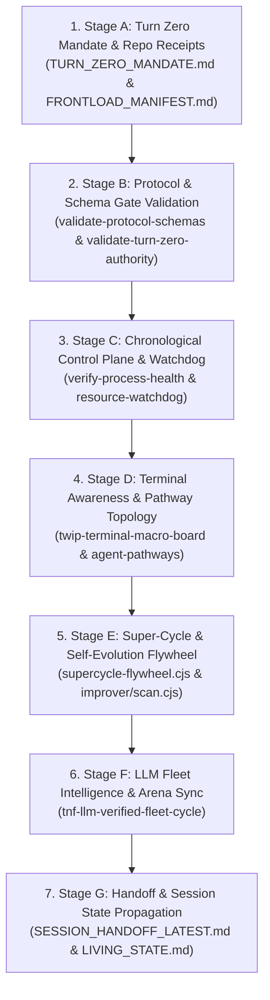

`[CLASS:PRIME] [STATUS:LOCKED] [DOC_TYPE:PROTOCOL_STANDARD] [VISIBILITY:COLLECTIVE]`

# TNF Continuous Self-Improvement Protocol (`TNF_CONTINUOUS_SELF_IMPROVEMENT_PROTOCOL`)

**Status:** ACTIVE  
**Protocol ID:** `TNF_SELF_IMPROVEMENT_CANONICAL_V1`  
**Canonical Repository Root:** `whodaniel/tnf-monorepo`  
**Governing Authority:** `docs/protocols/TURN_ZERO_MANDATE.md`

---

## 1. Purpose & Vision

The New Fuse (TNF) is a self-synthesizing, protocol-governed AI orchestration
engine. An AI agent or background daemon in TNF must never remain passive; it
must systematically traverse back through system structures in the exact logical
order mandated by the protocols.

This protocol defines the deterministic, multi-layered **Self-Improvement
Flywheel** that continuously detects drift, resolves friction, updates
registries, verifies capability parity, and enforces resource governance without
requiring manual operator intervention.

---

## 2. Logical Structural Traversal Order

All self-improvement and audit passes must execute in the strict, hierarchical
sequence below:



---

## 3. The 6-Stage Flywheel Engine

### Stage 1: Environment & Canonical Authority (Turn Zero)

- **Script/Gate:** `pnpm run tnf:onboard` /
  `scripts/protocols/validate-turn-zero-authority.cjs`
- **Verification:** Verifies git remote normalizes to `whodaniel/tnf-monorepo`,
  hashes `docs/core/FRONTLOAD_MANIFEST.md`, and validates that runtime prompt
  surfaces reference canonical Turn Zero authority.

### Stage 2: Protocol & Schema Integrity

- **Script/Gate:** `scripts/validate-protocol-schemas.cjs`
- **Verification:** Ensures all JSON protocols, agent definitions, MCP schemas,
  and event contracts strictly match current schema specifications.

### Stage 3: Chronological Process & Resource Watchdog

- **Script/Gate:** `scripts/protocols/verify-process-health.cjs` &
  `scripts/lib/tnf-resource-guard.cjs`
- **Verification:**
  - Inspects cron/launchd runtime states against cadence limits in
    `data/protocols/cron-jobs.registry.json`.
  - Enforces `CLASS_DEFAULTS` limits on memory (RSS), CPU, and wall-clock
    duration.
  - Automatically trips the circuit breaker to `paused` in
    `~/.tnf/fleet/mode.json` if system memory pressure exceeds 90% or CPU load
    spikes to dangerous levels.

### Stage 4: Terminal Awareness & Synaptic Bus Heartbeat

- **Script/Gate:** `scripts/runtime/terminal-heartbeat-pulse.cjs` &
  `scripts/protocols/synthetic-federation-gate-check.cjs`
- **Verification:**
  - JXA/AppleScript spatial scan of all active Terminal.app windows.
  - Verifies presence of idle agents and injects prompt nudges (`› TNF wake`,
    `› TNF heartbeat`) with keystroke submit logic.
  - Evaluates federation gate decisions with clean local/remote token fallback.

### Stage 5: System Improver & Tech-Debt Scan

- **Script/Gate:** `scripts/improver/scan.cjs` &
  `scripts/orchestrator/supercycle-flywheel.cjs`
- **Verification:**
  - Executes `tnf doctor` configuration diagnostics.
  - Scans codebase for `TODO`, `FIXME`, and broken dependency imports.
  - Dispatches actionable task items to `tnf:master:tasks:planning` on Redis.

### Stage 6: LLM Fleet & Model Preference Optimization

- **Script/Gate:** `scripts/llm-intel/tnf-llm-verified-fleet-cycle.cjs`
- **Verification:**
  - Probes live provider model endpoints (`/v1/models`).
  - Measures latency, cost-efficiency, and benchmark parity.
  - Automatically updates active provider configuration in
    `~/.tnf/model-providers.json` without hardcoding dated model lists.

---

## 4. Execution Modalities

The continuous self-improvement loop can be invoked in three operational modes:

### 1. Interactive Single Audit Pass

```bash
node scripts/protocols/tnf-master-reconciliation-runner.cjs
```

_Outputs telemetry to
`docs/operations/tnf-master-reconciliation-report-latest.md` and `.json`._

### 2. Autonomous Full-Auto Single Cycle

```bash
tnf full-auto once --base-url https://thenewfuse.com --api-url https://api.thenewfuse.com
```

### 3. Continuous Background Daemon

```bash
tnf full-auto daemon start --interval-minutes 30 --max-cycles 0 --broadcast
```

---

## 5. Non-Negotiable Safety & Attribution Tenets

1. **Silence is Never Success:** If an audit stage fails to run or is skipped
   due to missing files, it MUST be recorded as `UNRESOLVED` / `FINDINGS`, never
   as `PASSED`.
2. **Resource Overload Protection:** Background self-improvement loops must
   yield immediately to human operator workload whenever the resource watchdog
   trips.
3. **Commit & Push Gate:** Per `docs/core/AGENTS.md`, self-improvement cycles
   may generate local patches and reports, but git commits and branch pushes
   require explicit operator confirmation unless operating under pre-authorized
   autonomy keys.
4. **Attribution Lineage:** All distilled fixes and intelligence artifacts must
   cite original files, protocol IDs, and timestamped run receipts.
