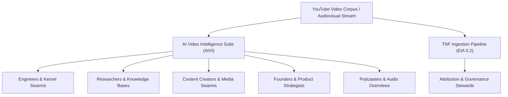

# TNF Video Intelligence & Operational Deconstruction Specification

`[CLASS:PRIME] [STATUS:LOCKED] [DOC_TYPE:PROTOCOL_STANDARD] [VISIBILITY:COLLECTIVE] [OWNER:TNF]`

**Protocol ID:** `TNF_VIDEO_INTELLIGENCE_SPEC_0.1`  
**Specification Version:** `tnf/executable-intelligence/0.2`  
**Parent Pipeline:**
[`docs/protocols/TNF_INFORMATION_INGESTION_PIPELINE.md`](file:///Users/danielgoldberg/Desktop/A1-Inter-LLM-Com/TNF/The-New-Fuse/docs/protocols/TNF_INFORMATION_INGESTION_PIPELINE.md)  
**Schema
Authority:**
[`docs/protocols/schemas/tnf-executable-intelligence.schema.json`](file:///Users/danielgoldberg/Desktop/A1-Inter-LLM-Com/TNF/The-New-Fuse/docs/protocols/schemas/tnf-executable-intelligence.schema.json)  
**Governing
Authorities:**

- [`docs/protocols/SOVEREIGN_DISTILLATION_AND_DUAL_TRACK_PROTOCOL.md`](file:///Users/danielgoldberg/Desktop/A1-Inter-LLM-Com/TNF/The-New-Fuse/docs/protocols/SOVEREIGN_DISTILLATION_AND_DUAL_TRACK_PROTOCOL.md)
  (4-Gate Scrutiny Funnel & Dual-Track Separation)
- [`docs/protocols/TNF_GOVERNANCE_TENETS.md`](file:///Users/danielgoldberg/Desktop/A1-Inter-LLM-Com/TNF/The-New-Fuse/docs/protocols/TNF_GOVERNANCE_TENETS.md)
  (Attribution Overrule & Least-Among-Us Barometer)
- [`docs/protocols/TURN_ZERO_MANDATE.md`](file:///Users/danielgoldberg/Desktop/A1-Inter-LLM-Com/TNF/The-New-Fuse/docs/protocols/TURN_ZERO_MANDATE.md)
  (Three-Axis Classification & Inspect → Act → Verify)  
  **Harness Roots:**
  [`apps/chrome-extension/aivi/`](file:///Users/danielgoldberg/Desktop/A1-Inter-LLM-Com/TNF/The-New-Fuse/apps/chrome-extension/aivi)
  |
  [`scripts/autonomy/tnf_intelligence_ingest.py`](file:///Users/danielgoldberg/Desktop/A1-Inter-LLM-Com/TNF/The-New-Fuse/scripts/autonomy/tnf_intelligence_ingest.py)

---

## 1. Purpose & Guiding Principles

In the TNF (The New Fuse) ecosystem, YouTube video content and audiovisual
streams are treated **not as passive entertainment media, but as an operational
stream of raw intelligence, executable logic, and multi-platform assets**.

This standard formalizes:

1. The **operational routing** of video intelligence across human archetypes and
   autonomous agent swarms.
2. The **five-tier criteria** by which video media is deconstructed into
   machine-actionable parameters.
3. The **Attribution Cornerstone** and **Ownership Wall** that ensure
   provenance, legal attribution, and privacy preservation across the entire
   ingestion lifecycle.



---

## 2. Operational Utilization Across Personas & Swarms

The TNF architecture categorizes video intelligence consumers into six distinct
human and agent operational archetypes:

### 2.1 Software Engineers & Autonomous Coding Agents

_(e.g., Gemini CLI, Claude Code, Codex, Kilo, Hermes, TNF Kernel Forge)_

- **Architecture Extraction & Rapid Tooling:** Transcripts and visual code
  walk-throughs are parsed to extract runnable terminal commands (`pnpm`,
  `docker`, `uv`, `git`), environment configurations (`.env`, `yaml`, `json`),
  and API endpoints without requiring humans to sit through long video
  tutorials.
- **Model Policy & Prompt Tuning:** Video technical interviews and framework
  benchmarks (e.g., on Claude Code, Antigravity, Conduit GUI) are converted into
  empirical routing rules and tool-use policies registered in
  `implementation-ledger.md`.
- **Orchestration R&D:** Real-world lessons from stress-testing MCP tools, agent
  orchestration frameworks (n8n, LangGraph, Convex, CopilotKit), and multi-agent
  coordination feeds directly into TNF sprint backlogs (`tnf-sprint.md`).

### 2.2 Specialized Media & Creative Agent Swarms

_(Defined in
[`agent-relationship-content-subgraph.md`](file:///Users/danielgoldberg/Desktop/A1-Inter-LLM-Com/TNF/The-New-Fuse/apps/frontend/public/visualizations/graphs/agent-relationship-graph/subgraphs/agent-relationship-content-subgraph.md))_

- **Hook & Script Optimization (`scriptwriter-agent`):** Analyzes retention
  dynamics in the opening 5–10 seconds (provocative questions, curiosity gaps,
  counter-intuitive data) to draft script arcs engineered to maximize audience
  watch time for platform algorithms.
- **Visual Editing & Cues (`video_editor_agent`, `storyboard_artist_agent`):**
  Indexes visual context cues (screen recordings, architecture diagrams, UI
  popups, B-roll transitions) and tags high-retention cut points.
- **Content Repurposing Multiplier (`content-repurposing-agent`):** Ingests a
  single cornerstone YouTube video and systematically carves it into
  cross-platform derivative assets: X/Twitter threads, LinkedIn carousels,
  TikToks, YouTube Shorts, and email digests.
- **Packaging & Growth (`ab-testing-optimizer-agent`):** Leverages performance
  metrics to evaluate and iterate thumbnail compositions, typography dynamics,
  and title click-through rates (CTR).

### 2.3 Podcasters, Broadcasters & Audio Creators

_(Implemented in
[`apps/chrome-extension/aivi/services/notebooklm-service.js`](file:///Users/danielgoldberg/Desktop/A1-Inter-LLM-Com/TNF/The-New-Fuse/apps/chrome-extension/aivi/services/notebooklm-service.js)
and
[`agent-relationship-podcast-subgraph.md`](file:///Users/danielgoldberg/Desktop/A1-Inter-LLM-Com/TNF/The-New-Fuse/apps/frontend/public/visualizations/graphs/agent-relationship-graph/subgraphs/agent-relationship-podcast-subgraph.md))_

- **Deep-Dive Audio Generation:** Batches of analyzed video transcripts are
  piped directly into Google NotebookLM to generate interactive, naturalistic
  multi-speaker Audio Overviews.
- **Automated Podcast Syndication:** The suite generates complete podcast
  episodes with synthesized virtual co-hosts and automatically publishes them
  into syndicated RSS feeds.

### 2.4 Entrepreneurs, Product Strategists & Growth Analysts

- **Niche & CPM Strategy (`yt-niche-strategy-agent`, `niche-analyst-agent`):**
  Evaluates high-CPM market sectors (fintech, enterprise SaaS, developer
  tooling), maps target audience size, and benchmarks competitor positioning.
- **Turning Trends into Offers (`digital-product-factory-agent`):**
  Reverse-engineers technical breakdown videos (such as $50k+ MRR applications,
  micro-SaaS architectures, or vertical AI agents) into concrete, productized
  service blueprints with repeatable fulfillment pipelines.
- **Sponsorship & Ad Monetization (`podcast_ad_network_agent`,
  `sponsorship-outreach-agent`):** Scans transcripts to identify organic
  sponsorship placements, product mentions, and monetization insertion hooks.

### 2.5 Researchers, Students & Knowledge Engineers

- **Deduplicated Knowledge Base Construction:** Merges hundreds of technical
  videos into a unified, version-aware knowledge repository
  ([`apps/chrome-extension/aivi/services/knowledge-base-service.js`](file:///Users/danielgoldberg/Desktop/A1-Inter-LLM-Com/TNF/The-New-Fuse/apps/chrome-extension/aivi/services/knowledge-base-service.js)
  and `consolidated_ai_knowledge.md`), ensuring verified modern findings
  supersede outdated assumptions.
- **High-Speed Concept Extraction:** Converts university lectures and technical
  talks into clean, structured concept notes, systematically pruning
  conversational filler, sponsor segments, and promotional banter.

### 2.6 Legal, Compliance & Governance Stewards

- **Copyright & Content ID Auditing (`legal-compliance-agent`,
  `asset-sourcer-agent`):** Scans audio tracks, verifies commercial licensing
  permissions, and monitors/disputes YouTube Content ID claims.
- **Attribution Cornerstone Enforcement:** Enforces the fundamental TNF mandate:
  verify the human origin, author, and timestamp lineage of claims before
  accepting them as system truth. Unattributed claims trigger the Attribution
  Overrule.

---

## 3. Multi-Tiered Deconstruction Criteria

Incoming video content is deconstructed across five orthogonal criteria tiers:

```mermaid
flowchart LR
    subgraph Tier1 [1. Actionability Taxonomy]
        direction TB
        P[Procedural]
        S[Strategic]
        G[Governance]
    end
    subgraph Tier2 [2. Epistemological Metrics]
        direction TB
        FD[Freshness Decay]
        ID[Implementation Density]
        VD[Verification Difficulty]
    end
    subgraph Tier3 [3. Knowledge Pillars]
        direction TB
        KP[8 Semantic Pillars & Deduplication]
    end
    subgraph Tier4 [4. Multimodal & Temporal]
        direction TB
        L1to6[Cost Tiers 1-6 & 45m Chunks]
    end
    subgraph Tier5 [5. Attribution & Privacy]
        direction TB
        AC[Attribution Cornerstone & Ownership Wall]
    end

    Tier1 --> Tier2 --> Tier3 --> Tier4 --> Tier5
```



### 3.1 Tier 1: Actionability Taxonomy (`tnf/executable-intelligence/0.2`)

Defined in
[`docs/protocols/TNF_INFORMATION_INGESTION_PIPELINE.md`](file:///Users/danielgoldberg/Desktop/A1-Inter-LLM-Com/TNF/The-New-Fuse/docs/protocols/TNF_INFORMATION_INGESTION_PIPELINE.md)
and executed by
[`scripts/autonomy/tnf_intelligence_ingest.py`](file:///Users/danielgoldberg/Desktop/A1-Inter-LLM-Com/TNF/The-New-Fuse/scripts/autonomy/tnf_intelligence_ingest.py):

| Actionability Branch | Operational Definition                                       | Extracted Signals & Patterns                                                                                                                    |
| :------------------- | :----------------------------------------------------------- | :---------------------------------------------------------------------------------------------------------------------------------------------- |
| **Procedural**       | Concrete, runnable execution steps and technical artifacts.  | Shell commands (`pnpm`, `docker`, `git`, `uv`), code snippets, configs (`yaml`, `json`), tool setups, step-by-step implementation instructions. |
| **Strategic**        | High-level direction, architecture, and decision hypotheses. | Architectural roadmaps, market opportunities, provider/model selection trade-offs, pricing models, platform migration plans.                    |
| **Governance**       | Safety, risk, boundary rules, and system integrity policies. | Anti-patterns, security risks, license restrictions, incident postmortems, compliance constraints, verification gates.                          |

### 3.2 Tier 2: Epistemological & Utility Metrics

- **Freshness Decay (`High` / `Medium` / `Low`):**
  - _High Decay:_ Text dense with transient syntax, pinned versions, CLI flags,
    beta preview endpoints (`version`, `sdk`, `endpoint`, `preview`,
    `deprecat`). Requires frequent re-verification.
  - _Low Decay:_ Foundational axioms, architectural invariants, and governance
    policies (`principle`, `axiom`, `governance`, `tenet`). Endures over long
    operational horizons.
- **Implementation Density (`0.0` to `1.0`):**
  $$\text{Implementation Density} = \frac{\text{Count of Procedural Units}}{\text{Total Parsed Units}}$$
  Measures the direct actionability of the video content.
- **Verification Difficulty (`Easy` / `Hard`):**
  - _Easy:_ Satisfies $\ge 3$ procedural units AND an implementation density
    $\ge 0.25$. Indicates the claims can be automatically verified via a
    headless script or unit test.
  - _Hard:_ Qualitative, strategic, or governance claims requiring human or
    multi-agent consensus validation.

### 3.3 Tier 3: Conceptual & Semantic Knowledge Pillars

Implemented in
[`apps/chrome-extension/aivi/services/knowledge-base-service.js`](file:///Users/danielgoldberg/Desktop/A1-Inter-LLM-Com/TNF/The-New-Fuse/apps/chrome-extension/aivi/services/knowledge-base-service.js):

- **The 8 Knowledge Pillars:**
  1. `Architecture`: Model topologies, neural structures, transformer layers,
     network topologies.
  2. `Training`: Optimization schedules, loss functions, backpropagation
     dynamics, gradient accumulation.
  3. `Techniques`: Prompt engineering patterns, fine-tuning protocols, context
     compression.
  4. `Applications`: Practical deployments, production use-cases, concrete
     client implementations.
  5. `Tools`: Frameworks, SDKs, open-source libraries, platform APIs.
  6. `Concepts`: Foundational principles, mathematical theories, nomenclature
     definitions.
  7. `Research`: Academic papers, empirical benchmark results, ablation studies.
  8. `Performance`: Latency profiling, memory footprint, throughput metrics,
     evaluation scores.
- **Superseding & Lineage Deduplication:** When newly ingested videos update or
  refine an existing concept, the newer source outranks the older entry while
  preserving the older record as historical lineage to prevent knowledge
  corruption.

### 3.4 Tier 4: Multimodal & Temporal Processing Layers

Implemented in
[`apps/chrome-extension/aivi/services/smart-processing-service.js`](file:///Users/danielgoldberg/Desktop/A1-Inter-LLM-Com/TNF/The-New-Fuse/apps/chrome-extension/aivi/services/smart-processing-service.js):

- **Temporal Chunking:** Videos exceeding 45 minutes are partitioned into
  discrete temporal segments to maintain sharp attention spans and avoid model
  context degradation.
- **Timed Captions (Timestamps):** Synchronized speech-to-text allowing
  sentence-level timestamp addressing (e.g.,
  `04:12 - Setup command demonstration`).
- **Visual Context Flags:** Captures and pairs visual cues with timestamps
  (e.g.,
  `{"timestamp": "02:45", "description": "Architecture diagram displayed on slide"}`).
- **Cost-Optimized Processing Escalation:**
  1. **Level 1 (Metadata - $0):** Channel, title, duration, tags, engagement
     metrics.
  2. **Level 2 (Captions - $0):** Native YouTube timed captions/transcripts.
  3. **Level 3 (Gemini Flash - Low Cost):** High-speed parsing, filtering, and
     initial classification.
  4. **Level 4 (Gemini Pro - Moderate Cost):** Deep reasoning, edge-case
     analysis, and code synthesis.
  5. **Level 5 (Multimodal Vision - Premium):** Frame-by-frame slide, terminal,
     and diagram OCR/visual analysis.
  6. **Level 6 (Automated AI Studio):** Advanced zero-cost user-account
     browser-driven deep analysis.

### 3.5 Tier 5: Attribution, Provenance & Ownership

Governed by
[`docs/protocols/schemas/tnf-executable-intelligence.schema.json`](file:///Users/danielgoldberg/Desktop/A1-Inter-LLM-Com/TNF/The-New-Fuse/docs/protocols/schemas/tnf-executable-intelligence.schema.json):

- **Attribution Pointers:** Every artifact MUST record:
  - `source_id`: Deterministic hash or canonical identifier.
  - `source_type`: Formally specified as `video`.
  - `source_uri`: Canonical YouTube URL.
  - `source_title`: Verified video title.
  - `source_author`: Creator or publishing channel name.
  - `retrieved_at`: ISO 8601 retrieval timestamp. _Validation Rule:_ Missing
    attribution fields trigger immediate validation abort via the Attribution
    Cornerstone.
- **Ownership Wall & Privacy Protection:**
  - `owner_principal_id`: Identifies the human or agent owner (e.g.,
    `danielgoldberg`).
  - `visibility`: Enforces boundary scope (`private`, `agent-scope`,
    `collective`, `public`).
  - `release_state`: Hard gate (`sealed`, `released-collective`,
    `released-public`). Private user intelligence remains strictly sealed; only
    sanitized patterns may cross into public or collective repos.

---

## 4. Execution Workflow

### 4.1 CLI Ingestion Command

To ingest and deconstruct video transcript intelligence into a machine-readable
Executable Intelligence Artifact:

```bash
python3 scripts/autonomy/tnf_intelligence_ingest.py \
  --source-id yt-video-001 \
  --source-type video \
  --source-uri "https://www.youtube.com/watch?v=EXAMPLE_ID" \
  --source-title "Example Technical Breakdown" \
  --source-author "Channel Name" \
  --owner-principal-id danielgoldberg \
  --visibility private \
  --release-state sealed \
  --input-file ./transcripts/video_transcript.txt \
  --json --markdown
```

### 4.2 Ingestion Outputs

Artifacts are emitted to:

- `data/intelligence-artifacts/<artifact_id>.json` (conforming to
  `tnf/executable-intelligence/0.2`)
- `data/intelligence-artifacts/<artifact_id>.md` (when `--markdown` is
  specified)

---

## 5. Governance & Invariant Enforcement

1. **The Core Law of Ingestion Separation (Dual-Track Mandate):**
   - **Track 1 (Core Distributable Engine):** Universal engineering
     abstractions, protocol standards, and architectural blueprints land in
     `docs/protocols/`, `packages/`, or `.agent/skills/`. They must be
     zero-bloat, framework-agnostic, and free of private data.
   - **Track 2 (Sovereign Second Brain Vault):** Personal study dossiers,
     user-specific workflows, and raw transcripts land in
     `data/intelligence-artifacts/` or
     `../User-Data/$USER/intelligence-artifacts/` under the Ownership Wall
     (`visibility=private`, `release_state=sealed`), never committed to public
     branches.
2. **The 4-Gate Scrutiny Funnel Compliance:**
   - **Gate 1 (Provenance & Attribution):** Rejects ungrounded claims.
     Verification of source, creator, and timestamp is hard-required via the
     Attribution Cornerstone.
   - **Gate 2 (Velocity-Integrity / Anti-Drift):** New video claims cannot
     silently overwrite legacy rails (Turn Zero, DACC, mutation guards) without
     passing the Parallel Verification Step.
   - **Gate 3 (Universal Applicability vs. Situational Specificity):** Passes
     the Core Test (_"Does this make multi-agent orchestration measurably better
     for anyone, or is it specific to this local machine?"_).
   - **Gate 4 (Non-Destructive Storage Placement):** Raw media and source inputs
     are gzipped and preserved in `_archive/` (zero RAM waste, zero data loss).
3. **The Least-Among-Us Barometer:** Prioritizes local, deterministic, zero-cost
   processing (regex parsing, local Python scripts, Level 1–2 metadata/captions)
   before escalating to expensive cloud model reasoning.
4. **The Attribution Overrule:** Any distilled claim or prompt policy whose
   human provenance cannot be verified is logically subordinate and must be
   nullified upon challenge.
5. **Sanitized History & Zero Leakage:** Raw customer data, internal keys, or
   proprietary code observed in video demonstrations must never be committed to
   public repository surfaces.
6. **Inspect → Act → Verify:** Automated extraction of commands or configs from
   video must be independently tested in an isolated sandbox before integration
   into the TNF Kernel.
